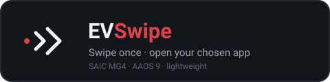

# EVSwipe

<p align="center"></p>

[](https://github.com/malys/EV_Swipe_Launcher/actions/workflows/tests.yml)
[](https://github.com/malys/EV_Swipe_Launcher/actions/workflows/security.yml)
[](https://github.com/malys/EV_Swipe_Launcher/actions/workflows/unstable.yml)
[](https://github.com/malys/EV_Swipe_Launcher/releases)
[](LICENSE.md)

EVSwipe is an app that enables a **swipe up** action from the bottom edge of the screen to quickly launch a user-selected app. This feature is especially useful for fast and easy access to a specific app of your choice.

It is part of the **EVSuite** (EVProfile, EVTasker, EVABRPUploader, EVLauncher) and shares its dark Material 3 theme, its CI/CD and security gates, and its two-channel release model.

> ⚠️ **This app uses accessibility and overlay capabilities on a vehicle head unit.**
> Do not interact with it while driving. Read [DISCLAIMER.md](DISCLAIMER.md) before
> installing. This independent project is not affiliated with or approved by SAIC Motor or
> MG Motor. MG and MG4 are third-party marks used only to identify compatibility.

> 💡 It pairs perfectly with [EVLauncher](https://github.com/Tommasov/EV_Simple_Launcher) — which is now the **default** swipe target. As the home launcher it stays warm in memory, so the swipe re-opens it almost instantly, for a clean, system-integrated home experience.

---

## Contents

- [⚠️ Upgrading from v1.2 (or earlier) — please read](#upgrading-from-v12-or-earlier-please-read)
- [Features](#features)
- [Configuration](#configuration)
- [Channels](#channels)
- [Building](#building)
- [Project documents](#project-documents)
- [Security](#security)
- [Contributing](#contributing)
- [Legal](#legal)

## ⚠️ Upgrading from v1.2 (or earlier) — please read
**EN —** The app is now signed with the **EVSuite platform key**, and its application id
changed from `com.tommasov.evswipenovalauncher` to `com.evsuite.swipe`. Either change
alone forces a fresh install: **uninstall the previous version first**, then install the new
one. Settings are stored per-app, so they are reset. The note below covers the earlier v1.4
key change and still applies to anyone coming from v1.2 or earlier.

Starting from **v1.4** the app is signed with a new, stable signing key.
Android does **not** allow installing an update over an app signed with a different
key, so you cannot update on top of an older build: you must **uninstall the
previous version first**, then install v1.4. This is a **one-time** step needed only
to migrate to the new signed builds — every future update will install normally,
with no uninstall. (Your settings are stored per-app, so they are reset on
reinstall.)

**IT —** A partire dalla **v1.4** l'app è firmata con una nuova chiave di firma
stabile. Android **non** consente di installare un aggiornamento sopra un'app
firmata con una chiave diversa, quindi non puoi aggiornare sopra una versione
precedente: devi prima **disinstallare la versione vecchia** e poi installare la
v1.4. È un passaggio **una tantum**, necessario solo per migrare alle nuove build
firmate — tutti gli aggiornamenti futuri si installeranno normalmente, senza
disinstallare. (Le impostazioni sono salvate per app, quindi verranno azzerate con
la reinstallazione.)

## Features
- **Swipe up from the bottom edge**: Quickly launch your chosen app with a simple swipe-up gesture.
- **Default target — EVLauncher**: out of the box the swipe opens [EVLauncher](https://github.com/malys/EV_Simple_Launcher) (`com.evsuite.launcher`). Being the home launcher it stays warm, so it re-opens almost instantly.
- **Any app works too**: Nova Launcher (or any installed app) can be chosen instead of the default from the EVSwipe main screen.
- **Configuration**: Select the app you want to launch by opening the EVSwipe app.

## Configuration
These options are configurable from the EVSwipe main screen:

- **Two swipe areas**: the bottom edge is split into a left and a right area. By
  default the left area triggers the back action (simulated physical back button)
  and the right area opens the selected app.
- **Swap the swipe areas (left ↔ right)**: exchanges the back and open actions
  between the two areas. The on-screen help labels at the bottom follow this
  setting — both their text **and** their background colour swap accordingly, so
  they always match the active layout.
- **Hide the floating back button**: hides the draggable floating back button,
  useful for car servicing (hidden by default).
- **Show a loader while opening**: shows a lightweight "Opening…" overlay over the
  launch transition. It gives immediate feedback that the swipe was registered and
  masks the brief window flash while the target app is brought to the foreground
  (off by default).
- **App version**: the installed version name is shown in the top corner of the
  main screen.
- **Check for updates**: suspended during the suite safety and legal audit.

## Channels
Two build flavors, like the sibling apps:

- **stable** — tagged releases, **no self-update**. The updater class is not in the
  APK and the manifest declares no `INTERNET` permission, so the app is fully
  offline by construction. Installed from a USB stick.
- **unstable** — a pre-release published on every push to `master`; OTA is audit-suspended,
  so updates are manual. Application id
  `com.evsuite.swipe.unstable`, so it installs beside a stable build.

If re-enabled after review, the unstable updater downloads to private cache, validates https and the GitHub allowlist
at every redirect, verifies the running app's certificate, then installs automatically via
`pm`. The cached APK is always deleted. Stable contains neither updater code nor network
permission.

## Building
Standard Android project (Java + Kotlin, AGP 8.6, Gradle 8.7, `minSdk 28` /
`targetSdk 34`). JDK 17 is required and pinned in `mise.toml`.

```
mise run build            # stable debug APK
mise run build-unstable   # unstable debug APK (OTA trigger audit-suspended)
mise run test             # JVM unit tests, both channels
mise run permissions      # permission-drift gate, same check the CI runs
```

Or directly:

```
./gradlew assembleStableDebug
./gradlew assembleUnstableDebug
```

APKs land under `app/build/outputs/apk/<channel>/debug/`.

To sign locally, in `gradle.properties` (never committed) or as environment
variables — the same EVSuite platform key used by EVProfile and EVTasker:

```
evsuite.keystore=/path/to/platform.keystore
evsuite.keystore.password=…
evsuite.key.alias=platform
evsuite.key.password=…
```


### Emulator

```
mise run emulator-setup    # one-off: SDK images + both AVDs (needs /dev/kvm)
mise run emulator-screen   # API 28 at MG4 panel geometry — the useful one for UI work
mise run emulator-car      # API 33 Automotive — automotive system UI, wrong OS version
mise run run               # build, install and start on whatever device is connected
mise run emulator-stop
```

Neither profile is faithful on both axes: the vehicle runs AAOS 9 (API 28), but Google
publishes no Automotive system image below API 33. The screen profile is the one that
matters here — the project targets 1920x1080 @ 160dpi
(`SWI68-29958-1300R69`). The `1920×720` quoted above is the usable app area left under the
system UI; set `EMU_HEIGHT=720` in `mise.toml` and re-run `emulator-setup` to model that
instead.

The AVDs are named per repo (`mg4simple-*`, `evswipe-*`), matching the `evtasker-*` /
`evabrp-*` convention used by the sibling projects.

The overlay and accessibility permissions this app is built around are both "special":
`adb install -g` does not grant them, and without them the app only shows its permission
gate. `mise run run` calls `mise run grant-permissions`, which sets the overlay appop and
appends the service to `enabled_accessibility_services`. That is a development shortcut for
a throwaway emulator — on a real head unit you grant both through the system screens,
deliberately.

### CI/CD

| Workflow | Trigger | Blocking |
|---|---|---|
| `tests.yml` | push / PR | JVM unit tests, both channels |
| `security.yml` | push / PR | permission-drift gate + gitleaks; mobsfscan / semgrep / OWASP are informational SARIF |
| `unstable.yml` | push to `master` | builds and publishes the rolling `unstable` pre-release |
| `release.yml` | `v*` tag | builds, checks, and publishes the stable APK |

Every `uses-permission` must be listed with a justification in
`.github/security/permission-allowlist.txt`, or the build fails.

## Project documents
- [SECURITY.md](SECURITY.md) — threat model, the accessibility/overlay posture, how to
  report a vulnerability privately
- [DISCLAIMER.md](DISCLAIMER.md) — no warranty, no liability, and what running this on a
  vehicle head unit means concretely
- [CONTRIBUTING.md](CONTRIBUTING.md) — ground rules and the checks to run before a PR
- [LICENSE.md](LICENSE.md) — MIT; this is a fork of an upstream project that publishes no
  licence of its own, read it before reusing anything
- [AGENTS.md](AGENTS.md) — architecture notes for contributors and coding agents

## Security
This app holds an accessibility service and draws over other apps, so its
declarations are kept as narrow as the code: `typeWindowStateChanged` only, with
`canRetrieveWindowContent="false"`. `AccService` forwards the foreground package
name to `SwipeService` and performs the global back action — it never reads window
content. See [SECURITY.md](SECURITY.md) for the full posture and what is in scope
for a report.

## Contributing
Read [CONTRIBUTING.md](CONTRIBUTING.md) before opening a pull request. In short: this
code runs in a moving vehicle, so changes stay small, carry tests, and say in the diff
what would break without them. Anything touching the interface follows
[DESIGN.md](DESIGN.md).

## Legal

The full text lives in [DISCLAIMER.md](DISCLAIMER.md). In short:

This project is provided **for study and educational purposes only**. It is an
experimental, non-commercial project and is not affiliated with, endorsed by, or
supported by SAIC, MG, Nova Launcher, or any vehicle manufacturer.

The software is provided "as is", without warranty of any kind, express or
implied. The author accepts **no liability** for any direct, indirect, incidental,
or consequential damage of any kind — including but not limited to damage to the
vehicle, its infotainment system, software, or data, loss of functionality, or
safety-related consequences — arising from the installation or use of this app.
You use it entirely **at your own risk**. Do not interact with the app while
driving.

All graphic resources, trademarks, and brand names belong to their respective
owners and are used here for study purposes only.
